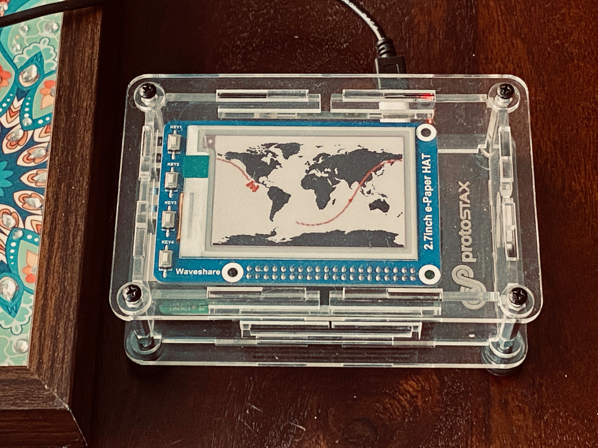

# ProtoStax_ISS_Tracker
Demo for ProtoStax ISS Tracker with ePaper Display and Raspberry Pi




using
[ProtoStax for Raspberry Pi B+](https://www.protostax.com/products/protostax-for-raspberry-pi-b)

For further instructions, see the
[International Space Station Tracker](https://www.hackster.io/sridhar-rajagopal/international-space-station-tracker-6afdca)
Tutorial at [Hackster.io](https://www.hackster.io/sridhar-rajagopal/international-space-station-tracker-6afdca)


## Prerequisites

* Enable SPI on the Raspberry P
* Python 3 or higher. The code and the ePaper library assumes you are
  using Python 3 or higher! (with Raspbian Buster, the latest is
  Python3.7)

**Install spidev, RPi.gpio, Pillow and requests**
**NOTE - Use sudo pip3!**

```
sudo apt-get install python3-spidev
sudo apt-get install rpi.gpio
sudo apt-get install python3-pil
sudo pip3 install requests
```


## Installing

This demo uses Waveshare's ePaper libary - see
[https://github.com/waveshare/e-Paper](https://github.com/waveshare/e-Paper)

but includes the necessary files from that library directly, so you
**don't need to install anything extra**!

```
git clone https://github.com/protostax/ProtoStax_ISS_Tracker.git
```

## Usage

```
cd ProtoStax_ISS_Tracker
```

**NOTE - Using Python 3 or higher!**

```
python3 iss.py
```

The program will run every 30 seconds, updating the
display with the current location of the ISS as well as the trajectory recorded
since the start.


## Running the script as a service

As an alternative, the Python script can be started during boot by creating a service - more info at https://www.raspberrypi.org/documentation/linux/usage/systemd.md

1. Create a new file called isstracker.service and copy the contents below to the new file - adjust the **WorkingDirectory** path accordingly:

```
[Unit]
Description=ISS Tracker
After=network-online.target
Wants=network-online.target

[Service]
ExecStart=/usr/bin/python3 iss.py
WorkingDirectory=/home/pi/ProtoStax_ISS_Tracker
StandardOutput=inherit
StandardError=inherit
Restart=always
User=pi

[Install]
WantedBy=multi-user.target

```

2. Copy the isstracker.service file into /etc/systemd/system as root:

```
sudo cp isstracker.service /etc/systemd/system/
```

3. Start the service:
```
sudo systemctl start isstracker.service
```

4. Check if the service is running:

```
sudo systemctl status isstracker.service
```

The output should be similar to:
```

 isstracker.service - ISS Tracker
   Loaded: loaded (/etc/systemd/system/isstracker.service; enabled; vendor preset: enabled)
   Active: active (running) since Tue 2020-06-30 07:00:00 BST; 24s ago
 Main PID: 585 (python3)
    Tasks: 1 (limit: 2200)
   Memory: 19.1M
   CGroup: /system.slice/isstracker.service
           └─585 /usr/bin/python3 iss.py

Jun 30 07:00:00 isstracker systemd[1]: Started ISS Tracker.

```

5. If the service is running fine, you can enable it and reboot the Raspberry Pi to load it automatically during boot:
```
sudo systemctl enable isstracker.service
```

6. To stop the service:
```
sudo systemctl stop isstracker.service
```


## License

Written by Sridhar Rajagopal for ProtoStax. BSD license, all text above must be included in any redistribution

A lot of time and effort has gone into providing this and other code. Please support ProtoStax by purchasing products from us!
Also uses the Waveshare ePaper library. Please support Waveshare by purchasing products from them!
